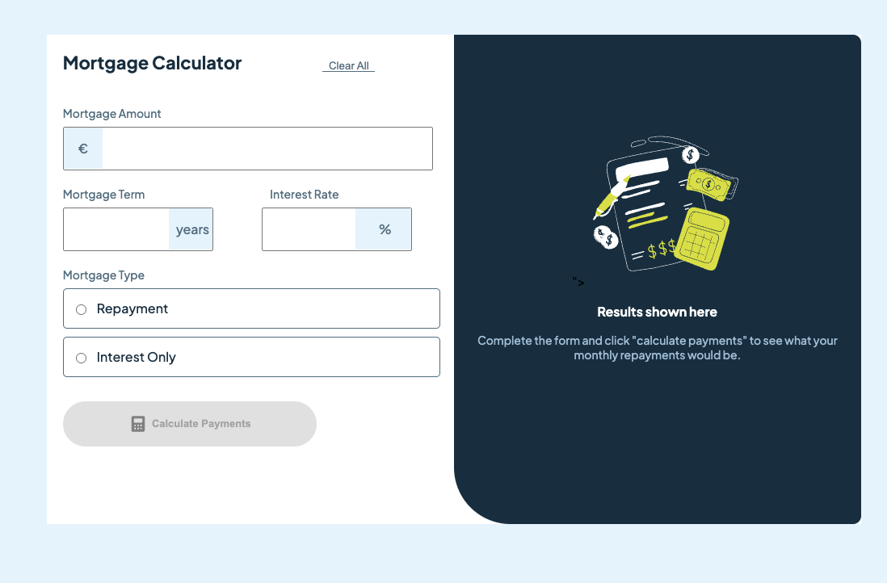
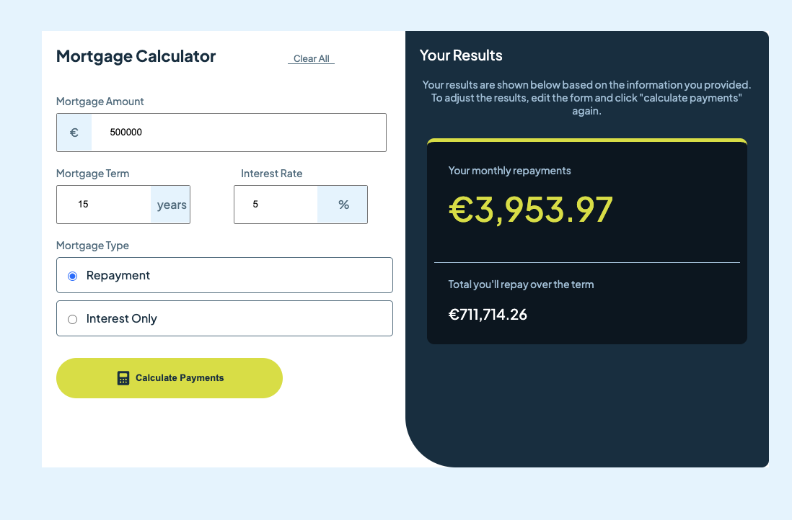

# MortgageCalculatorApp

- This project was generated using [Angular CLI](https://github.com/angular/angular-cli) version 19.1.6.
- Exploring Reactive Forms
- Desktop only version


## Built with

- Semantic HTML5 markup
- CSS custom properties
- Flexbox
- Typescript
- Angular


## Screenshots





## Running the app

Install dependencies and run:

```bash
npm install
ng serve
```
